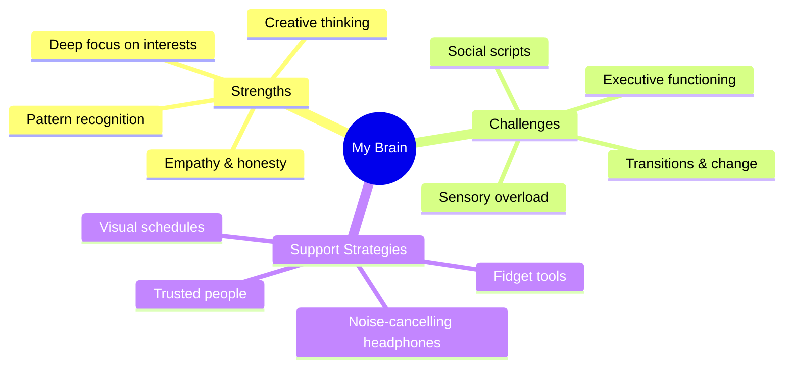

# 🌟 Lesson One: Understanding My Unique Brain
### Git Spark — Neuro-Responsive Starter Template

---

## ⚡ STEP 0 — Quick Pulse Check (`/pulse`)

> Before we begin, let's calibrate your experience.

**Answer these three quick questions:**

1. **How are you feeling right now?**
   - 😰 Anxious / Overwhelmed
   - 😴 Tired / Low Energy
   - 😐 Okay / Neutral
   - 🎯 Focused
   - 🤩 Excited

2. **How do you want to learn today?**
   - 🎨 Visual / Draw (Canva Mode)
   - 🎙️ Audio / Talk (Podcast Mode)
   - ✍️ Text / Write (Journal Mode)
   - 🔧 Interactive / Build (Maker Mode)

3. **What's your environment like right now?**
   - 🔇 Quiet & calm
   - 📢 Noisy / lots going on
   - 🌀 High-distraction (people, screens, etc.)

---

## 🎯 LEARNING GOAL

> **By the end of this lesson, you will be able to:**
> - Name at least 2 ways your brain processes the world differently.
> - Identify 1 strength that comes from how your brain works.
> - Create a personal "Brain Map" as your Learning Evidence.

**Why this matters:** Understanding yourself is the foundation for building the best strategies, tools, and support systems for *your* life.

---

## 📊 Progress Checklist

- [ ] Completed the Pulse Check
- [ ] Read or watched the core concept (adapted to your Learning Mode)
- [ ] Identified 1 personal strength
- [ ] Created your Brain Map (Learning Evidence)
- [ ] Received strengths-based feedback

---

## 📖 CORE CONCEPT (Auto-Adapted by Learning Mode)

### 🎨 Visual / Canva Mode
> Remix the SVG template below — drag in your own words, colors, and icons.

```svg
<svg width="600" height="400" xmlns="http://www.w3.org/2000/svg" font-family="sans-serif">
  <!-- Background -->
  <rect width="600" height="400" fill="#f0f4ff" rx="20"/>

  <!-- Title -->
  <text x="300" y="45" text-anchor="middle" font-size="22" font-weight="bold" fill="#3730a3">🧠 My Brain Map</text>

  <!-- Left brain zone: Challenges -->
  <ellipse cx="170" cy="210" rx="130" ry="110" fill="#fde68a" stroke="#f59e0b" stroke-width="2"/>
  <text x="170" y="185" text-anchor="middle" font-size="13" fill="#78350f">Things that are</text>
  <text x="170" y="203" text-anchor="middle" font-size="13" fill="#78350f">harder for me</text>
  <text x="170" y="230" text-anchor="middle" font-size="12" fill="#92400e">✏️ [Write here]</text>
  <text x="170" y="250" text-anchor="middle" font-size="12" fill="#92400e">✏️ [Write here]</text>

  <!-- Right brain zone: Strengths -->
  <ellipse cx="430" cy="210" rx="130" ry="110" fill="#bbf7d0" stroke="#22c55e" stroke-width="2"/>
  <text x="430" y="185" text-anchor="middle" font-size="13" fill="#14532d">My Strengths</text>
  <text x="430" y="203" text-anchor="middle" font-size="13" fill="#14532d">&amp; Superpowers</text>
  <text x="430" y="230" text-anchor="middle" font-size="12" fill="#166534">⭐ [Write here]</text>
  <text x="430" y="250" text-anchor="middle" font-size="12" fill="#166534">⭐ [Write here]</text>

  <!-- Center overlap: My Identity -->
  <text x="300" y="205" text-anchor="middle" font-size="12" font-weight="bold" fill="#1e1b4b">This is</text>
  <text x="300" y="222" text-anchor="middle" font-size="12" font-weight="bold" fill="#1e1b4b">ME 💜</text>

  <!-- Footer -->
  <text x="300" y="375" text-anchor="middle" font-size="11" fill="#6b7280">Created with Git Spark — Autism Assistant</text>
</svg>
```

---

### ✍️ Text / Journal Mode
> Read the passage below, then answer the journal prompt.

**Every brain is wired differently.**

Some brains notice tiny details that others miss. Some brains feel sounds or textures more intensely. Some brains make unexpected connections between ideas — that's where creativity and innovation live.

Being autistic, having ADHD, dyslexia, or other neurological differences means your brain has a **unique operating system**. It's not broken — it's different. And different can be a superpower.

**Journal Prompt:**
> *"Describe a moment when the way your brain works helped you do something well, notice something others didn't, or solve a problem in a creative way."*

---

### 🔧 Interactive / Builder Mode
> Use the Mermaid.js diagram below as your starting map. Edit the labels to match your own brain.



---

### 🎙️ Audio / Talk Mode
> Listen to (or read aloud) the script below, then record or write a 60-second response.

**Script (read slowly and clearly):**

*"Your brain is one of a kind. The way it processes information — sights, sounds, feelings, ideas — is completely unique to you. Today, we're going to explore two things: the challenges that come with how your brain works, and the incredible strengths that come with it too. Because here's the truth: the same brain that struggles in a noisy cafeteria might also be the brain that remembers every detail of a favorite topic, or spots a pattern that nobody else saw."*

**Your Response Prompt:**
> *"In 60 seconds or less — spoken or written — tell me: what is one thing your brain does really well?"*

---

## 🏆 LEARNING EVIDENCE — Create Your Brain Map

> Choose ONE of these creation formats:

| Format | What to Create |
|---|---|
| 🖼️ **Infographic** | Remix the SVG Brain Map above with your personal details |
| 📝 **Pitch Script** | Write a 3-sentence "elevator pitch" about your brain's strengths |
| 🗺️ **Logic Map** | Edit the Mermaid.js mindmap with your own labels and strategies |

**When you're done, run `/evidence`** to get strengths-based feedback on your creation.

---

## ✅ Feedback Criteria (Strengths-Based)

Your creation will be reviewed against these goals:

| Goal | Evidence of Learning |
|---|---|
| Named differences | Your map or script includes at least 2 specific ways your brain works differently |
| Named a strength | You identified at least 1 genuine strength tied to your neurology |
| Personal voice | The creation feels like *you* — not a generic answer |

---

## 🔁 Remix This Lesson

Not working for you today? Run `/remix` to switch modes:

- `/remix visual` — Get a new infographic template
- `/remix audio` — Get a new script and audio prompt
- `/remix text` — Get a new journal prompt
- `/remix build` — Get a new interactive diagram

---

*Powered by Git Spark — Neuro-Responsive CMS | Autism Assistant Project*
